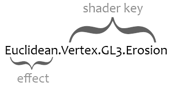

Haxe Shader Wrangler
====

This is a haxe port of "[OpenGL Shader Wrangler](http://prideout.net/blog/?p=11)" by Philip Rideout


##facts

- This is a string manipulator
- No dependency on OpenGL
- Not even dependent on use for Shaders
- Easy to implement, with load callback
- Very simple api (2 feature functions)
- Detailed logging (see below)
- Cross target/platform code
- The code is well documented
- Test code includes example usage in full


##to run the test

- Install [Haxe](http://haxe.org)
- `cd tests/`
- `haxe build.hxml`

This will generate a `run.n` file, and run `neko run.n` which will run the binary. There is a prebuilt version included. If installed through haxelib, `haxelib run hxsw` will print the example as well.

##to use the code

- copy `hxsw/` to your project

OR

- or use `haxelib install hxsw`
- use `haxelib git hxsw https://github.com/underscorediscovery/hxsw.git`
- then add -lib to your hxml, or as a dependency in your IDE/project

##license

MIT (see LICENSE.md)    
It's preferable the HXSW.hx file maintains it's licensing info at the top as well.

##versions

- 1.0.0 - Initial implementation

##about

####The following below is taken from the original [blog post](http://prideout.net/blog/?p=11):

To recap, you’d like to avoid creating a separate file for every friggin’ shader in your OpenGL program, especially with the advent of purely shader-based OpenGL and the new programmable stages in OpenGL 4.0. You’d also like to avoid big frameworks that attempt to accommodate other API’s like DirectX.

So, you need a lightweight solution that can organize your shader strings, load them up in a convenient manner, and automatically prepend #line directives. ... To that end, I wrote an “OpenGL Shader Wrangler” (GLSW), a tiny library that does the following:

- Chops up simple “effect” files into lists of strings
- Automatically prepends shaders with #line to enable proper error reporting
- Optionally prepends shader directives like #version and #extension
- Associates each shader with a quasi-hierarchical path called a shader key

#####vocabulary 

Here’s an example effect key with four tokens:



**effect**   
Simple text file that contains a bundle of shaders in any combination. For example, an effect might have 3 vertex shaders and 1 fragment shader. It might have 0 vertex shaders, or it might contain only tessellation shaders. Effects should not be confused with OpenGL program objects. A program object is a set of shaders that are linked together; an effect is just a grouping of various shader strings.

**shader key**   
Identifier for a shader consisting of alphanumeric characters and periods. In a way, the periods serve as path separators, and the shader key is a path into a simple hierarchy of your own design. However, HXSW does not maintain a hierarchy; it stores shaders in a flat list.

**effect key**   
Same as a shader key, but prefaced with a token for the effect. Your C/C++ code uses an effect key when requesting a certain shader string.

**token**   
Contiguous sequence of alphanumeric characters in a shader key (or effect key) delimited by periods.

**section divider**   
Any line in an effect file that starts with two dash characters (--). If the dashes are followed by a shader key, then all the text until the next section divider officially belongs to the corresponding shader.

**directive**   
Any line of GLSL code that starts with a pound (#) symbol.


--

In the above example, I placed the shader stage in the second token and the API version in the third token. You aren’t required to arrange your shader keys in this way. The only requirement is that the first token corresponds to the effect file. You don’t need to use the GL3 notation for your version tokens either; in fact, you don’t have to include a version token at all. The onus is on you to create a consistent hierarchy and naming convention.

##simple example

```glsl

-- Vertex

in vec4 Position;
void main() {
    gl_Position = Position;
}

-- Fragment

uniform sampler2D Sampler;
out vec4 FragColor;
void main() {
    ivec2 coord = ivec2(gl_FragCoord.xy);
    FragColor = texelFetch(Sampler, coord, 0);
}

```

Here’s how you’d use HXSW to pluck out strings from the preceding file and automatically prepend them with #line:

```
var sw = new HXSW({ load_effect: load_file_handler });

var vs = sw.get('Blit.Vertex');
var fs = sw.get('Blit.Fragment');
```

HXSW handles everything except file reading; you do that with load_effect. HXSW then takes the first token from the effect key that you pass to `get`, then checks if it has the effect cached; if not, it finds a file by decorating the effect name with a path prefix (in this case, the default, `./`) and a path suffix (in this case, the default, `.glsl`).

##Ignored Text

If a section divider in your effect file does not contain any alphanumeric characters, then all text is ignored until the next section divider (or the end of the file). Also, any text that precedes the first section divider is ignored (this could be useful for a copyright notice).

If a section divider does declare a legal shader key (i.e., the first contiguous sequence of alphanumeric characters and periods), then any characters appearing before and after the shader key are ignored.

For example, the following is a silly but valid effect file:

```
______  _  _  _   
| ___ \| |(_)| |  
| |_/ /| | _ | |_ 
| ___ \| || || __|
| |_/ /| || || |_ 
\____/ |_||_| \__|
                  
-------- Vertex --------

in vec4 Position;
void main() {
    gl_Position = Position;
}

--- /\/\/\/\/\/\/\/\ ---

Contrariwise, if it was so, it might be; and if it were so,
it would be; but as it isn't, it ain't. That's logic. 

--[[[[[ Fragment <== Brigadier Lethbridge-Stewart

uniform sampler2D Sampler;
out vec4 FragColor;
void main() {
    ivec2 coord = ivec2(gl_FragCoord.xy);
    FragColor = texelFetch(Sampler, coord, 0);
}

```

##Error Handling and Shader Key Matching
HXSW never aborts or throws exceptions. It returns 0 on failure and lets you fetch the most recent error string using `sw.error`, where sw is an instance. This can happen if it can’t find the file for your specified effect key, etc. The following are error states:

Errors are encountered under the following conditions, each will also give additional information where possible:

- Malformed effect key
    - set when the effect key given to `get` is invalid.
    - a valid effectkey has Effect.Shader, requiring a . delimeter
- Unable to open effect file
    - set when the file load function returns a blank string
    - implementation details of the reasons are outside of this code
- Could not find shader with key
    - `get` requested a shader that was not found in the effect/s
- Cannot add blank directive, only blank tokens.
    - storing a blank directive makes no sense, only a blank token is valid

When HXSW tries to find a shader key that matches with the effect key requested from your user code, it doesn’t necessarily need to find an exact match. Instead, it finds the longest shader key that matches with the beginning of your requested effect key. For example, consider an effect file called TimeMachine.glsl that looks like this:

```
-- Vertex
FOO
-- Geometry
BAR
-- Fragment.Erosion
BAZ
-- Fragment.Grassfire
QUX
-- TessControl
QUUX
-- TessEvaluation
QUUUX
```

If your user code does this:

```haxe

var sw : HXSW;

function load() {

	sw = new HXSW({...});

	test("TimeMachine.Vertex.Grassfire");
	test("TimeMachine.Fragment.Grassfire");
	test("TimeMachine.Fragment.Cilantro");
	test("Madrid");
	
}

function test(key:String) {

    var shader = sw.get(key);
    if(shader == '') {
        trace(sw.error);
    } else {
        trace(shader);
    }

} //test
```

Then your output would be this:

```
FOO
QUX
Could not find shader with key 'TimeMachine.Fragment.Cilantro'.
Unable to open effect file 'Madrid.glsl'.
```

Note that the first requested effect key did not report an error even though that exact shader key does not exist in the effect file. Here’s an example where this is useful: you’d like to use the same vertex shader with two different fragment shaders, but your rendering engine forms the string for effect keys in a generic way. 

HXSW will simply return the longest key that matches with the beginning of the requestion key. This avoids complicating the file format with support for cross-referencing.

##Directive Mapping
This is the only function we haven’t explained yet:

`add_directive(token:String, directive:String);`  
This tells HXSW to add a token-to-directive mapping. Whenever it sees a shader key that contains the specified token, it prepends the specified directive to the top of the shader. If the specified token is an empty string, then the specified directive is prepended to all shaders. For example, given this user code:

```haxe

sw.add_directive("", "#define FOO 1");
sw.add_directive("GL32", "#version 140");
sw.add_directive("iOS", "#extension GL_OES_standard_derivatives : enable");

var effectKey = '';

effectKey = "Blit.ES2.iPhone.Fragment";
trace(sw.get(effectKey) + '\n');

effectKey = "Blit.GL32.Fragment";
trace(sw.get(effectKey) + '\n');

```

You’d get output like this:


```glsl
	Blit.ES2.iPhone.Fragment:
	#define FOO 1
	#extension GL_OES_standard_derivatives : enable
	#line 7
	void main() {}
	
	Blit.GL32.Fragment:
	#define FOO 1
	#version 140
	#line 51
	void main() {}

```

You can also use an effect name for the token parameter in `add_directive`, which tells HXSW to prepend the specified directive to all shaders in that effect.


##example output

This only makes sense if you have [seen the code](tests/Main.hx)   

####[With Logging](tests/output_with_logging.md)
####[Without Logging](tests/output_without_logging.md)

&nbsp;

---

[Feedback? Bugs? Issues? Chat?](https://github.com/underscorediscovery/hxsw/issues)

--
